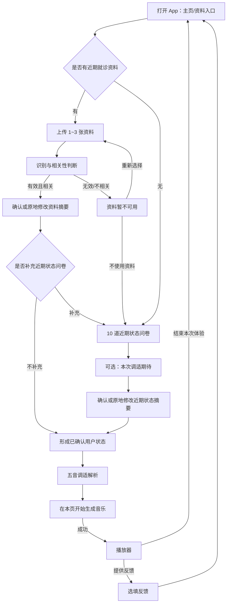
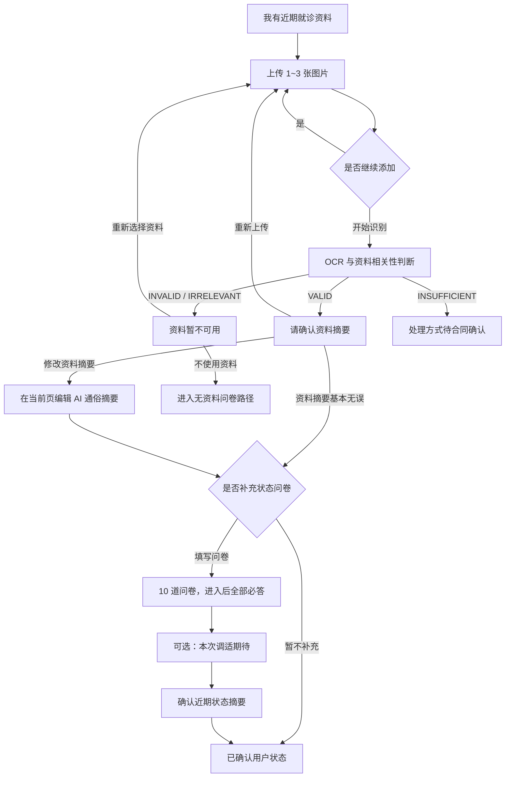
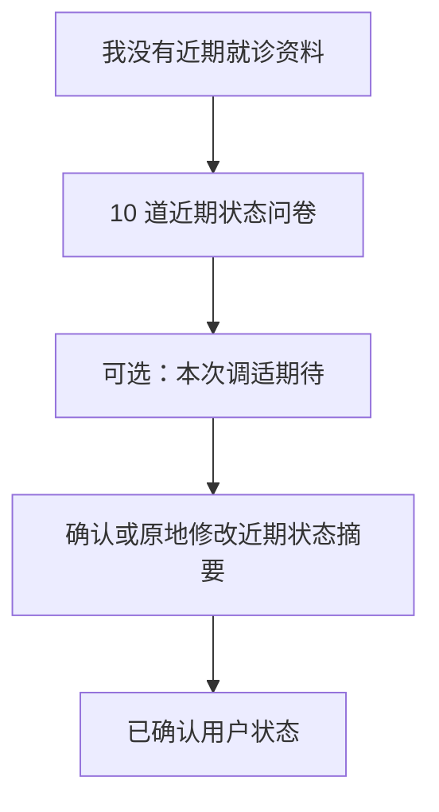

# HarmonyAI V3.1 暂定版产品流程

> 状态：**PROVISIONAL — Pending Teacher Confirmation**
> 用途：供老师与团队确认 V3.1 用户流程。本文不是最终冻结合同，不授权合入业务实现。

## 1. 适用范围

本文只定义用户在 App 中看到的主流程、页面分支与必填规则。Agent、数据库与 Provider 的技术实现以对应合同草案为准。App 名称、Logo、部分提示文案和反馈标签仍待确认。

## 2. 总体流程

V3.1 主路径不再单独经过 Welcome、Narrative 或 Generation Complete 页面。删除主路径不等同于立即删除旧页面、旧字段或兼容代码。

## 3. 有近期就诊资料

### 3.1 上传页

- 上传资料为必需步骤，可选 1～3 张清晰图片。
- 每次上传后停留在本页，展示缩略图，并支持删除与继续添加。
- 达到至少 1 张后，用户可点击“开始识别”。
- 上传资料只用于本次状态理解；隐私说明需保持简洁可见。

### 3.2 识别异常页

当资料无法识别或与本次状态无关时，不进入摘要确认，也不将失败内容交给后续 Agent。

提供：

- “重新选择资料”
- “没有合适资料，通过状态问卷继续”

`INSUFFICIENT` 的最终分流尚未冻结，必须等待合同确认。

### 3.3 摘要确认页

页面展示 AI 整理后的通俗摘要，而不是让用户编辑复杂 OCR 原文。

提供：

- “资料摘要基本无误”
- “修改资料摘要”：在当前页面原地编辑
- “重新上传资料”

用户最终确认后的摘要才是后续分析的权威资料摘要。页面可根据摘要给出动态补充建议，但不得把建议伪装成用户事实。

### 3.4 是否填写问卷

- 有资料用户可选择不填写问卷，直接继续。
- 若用户选择填写，则 Q1～Q10 全部必答，不可中途以“不完整问卷”提交。

## 4. 无近期就诊资料

- 直接进入 Q1～Q10。
- 十题全部必答，不允许跳过整个问卷。
- 不再要求用户填写“最近发生的事情”或语音 Narrative。

## 5. 问卷与 UserGoal

- 问卷固定为 Q1～Q10，共 5 页，每页 2 题。
- 不包含 Q11/Q12。
- 页面不向用户展示脏腑内部映射或评分规则。
- 完成问卷后进入独立、可跳过的 UserGoal 页面，建议展示为“本次调适期待”。
- UserGoal 仅用于音乐设计偏好，不是医学证据，也不能覆盖资料与问卷事实。

## 6. 权威用户状态

三条合法路径最终都形成 `ConfirmedUserState`：

1. 有资料、不填问卷：用户确认的资料摘要。
2. 有资料、填写问卷：用户确认的资料摘要与完整问卷综合结果。
3. 无资料：完整问卷结果及用户确认的状态摘要。

若展示的状态摘要有误，用户应在确认页原地修改；确认后的版本才可交给后续分析。

## 7. 五音调适解析与音乐

“五音调适解析”按解释链展示现有真实结果：

1. 本次确认的状态；
2. 状态倾向及依据引用；
3. 主音与可选辅音；
4. BPM、乐器、环境音、时长；
5. 每项参数的简短说明。

所有值必须来自后端分析与处方结果，不得由前端硬编码。用户在该页点击生成；成功后直接进入播放器，不再经过独立“生成完成”页面。

播放器保留真实播放能力、收藏能力（若当前服务可用）和必要说明；删除“AI生成音乐”“宫音为主”“本次”等重复标签。用户可以“反馈本次体验”或“结束本次聆听”；结束后直接返回主页。

## 8. 反馈

- 反馈整体为选填，用户可以直接结束。
- 喜欢项、调整项与自由反馈可以形成偏好，但不得修改或覆盖医学/状态证据。
- 最终反馈标签和具体文案仍待确认。

## 9. Sprint 5 主路径之外

Profile、收藏列表、历史生成记录不属于本轮 V3.1 核心主路径；旧 Narrative、旧 Welcome、独立 Generation Complete 也不得重新接入 V3.1 主路径。

## 10. 待老师确认

- App 最终名称与 Logo。
- `INSUFFICIENT` 资料相关性结果的分流。
- UserGoal 最终选项与展示文案。
- 反馈选项最终文案。
- “五音调适解析”页面对医学措辞的最终审阅。
