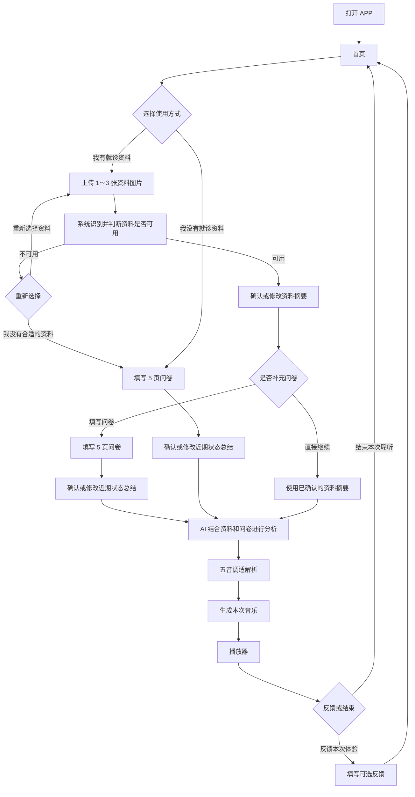
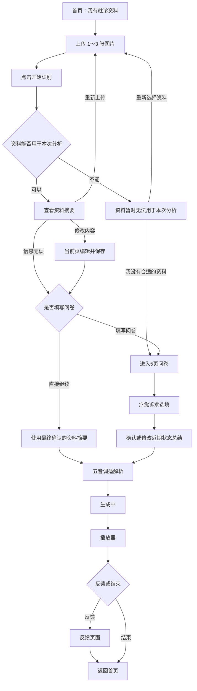
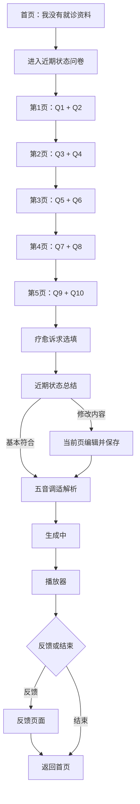

# APP V3.1 使用流程说明

## 1. 当前流程说明

这份文件用于说明用户打开 APP 后的完整使用过程。

- APP 正式名称：`【APP新名称待定】`
- Logo：`【新Logo待设计】`
- 打开 APP 后直接进入首页，不再经过旧 Welcome 页。
- 原“说说最近发生了什么”自由描述页删除，有资料和无资料流程都不再经过文字或语音描述页。
- 用户可以选择“我有就诊资料”或“我没有就诊资料”，两条路径最终都会进入五音调适解析、音乐生成和播放器。

## 2. APP 总体流程图

## 3. 首页

用户打开 APP 后，第一眼看到简洁的首页：

- `【新Logo】`
- `【APP新名称待定】`
- “了解你的近况”
- “为你生成专属音乐”

首页提供两张图片式入口卡片：

1. **我有就诊资料**
   - 辅助文字：“上传资料”
   - 点击后进入上传就诊资料页面。
2. **我没有就诊资料**
   - 辅助文字：“填写问卷”
   - 点击后直接进入近期状态问卷。

首页不堆放大段介绍，让用户能直接选择适合自己的入口。

## 4. 有就诊资料流程

### 4.1 上传就诊资料

用户点击“我有就诊资料”后，可以上传 **1～3 张图片**。上传区域参考微信朋友圈的操作方式：

- 初始：`[ + 上传资料 ]`
- 上传一张：`[图片1 ×] [ + ]`
- 上传两张：`[图片1 ×] [图片2 ×] [ + ]`
- 上传三张：`[图片1 ×] [图片2 ×] [图片3 ×]`

达到三张后不再显示“+”。每张图片右上角都有“×”，删除图片后会重新出现“+”。

上传图片后仍停留在当前页面，不会自动跳转。用户检查完图片，再点击 **“开始识别”**。

### 4.2 判断资料是否可用

系统识别并整理资料，然后判断它是否能用于本次状态分析。

- **资料可用**：进入“确认资料信息”页面。
- **资料无关、无法识别或不适合本次分析**：进入异常提示页面。

异常页面显示：

- 标题：“这份资料暂时无法用于本次分析”
- 说明：“未识别到与本次状态评估相关的有效信息，请检查是否上传了合适的就诊资料。”

页面提供两个按钮：

- **重新选择资料**：返回上传资料页面。
- **我没有合适的资料**：转入无资料流程，直接进入问卷。

页面不使用“病例无效”或“病历有问题”等容易引起误解的说法。

### 4.3 确认或修改资料信息

资料可用时，页面展示系统根据用户实际上传内容整理出的资料摘要，不预设固定病例结果。

用户可以选择：

- **信息无误，继续**：确认当前摘要。
- **修改内容**：摘要框直接在当前页面变为可编辑状态。
- **重新上传**：返回上传资料页面。

修改时，用户可以删除、补充或改写摘要。页面可以提供“常用补充”提示词，例如“近期压力较大”，但这些只代表界面形式；真实提示词需要根据当前摘要动态产生，不能固定写死，也不能与资料内容冲突。

点击提示词后，内容补入摘要编辑框，用户仍可继续编辑。完成后点击 **“保存并继续”**，后续分析只使用用户最终确认的摘要。

### 4.4 是否填写问卷

资料摘要确认后，进入轻量选择页：

- 标题：“想再补充一些近况吗？”
- 说明：“填写问卷可以帮助我们更完整地了解你最近的状态。”

用户可以选择：

- **填写问卷**：进入5页近期状态问卷。
- **直接继续**：使用最终确认的资料摘要进入后续分析，不再重复出现“近期状态总结”确认页。

因此，有就诊资料的用户可以不填写问卷。

`【原自由描述页删除】`

## 5. 无就诊资料流程

用户点击首页的“我没有就诊资料”后：

1. 直接进入近期状态问卷。
2. 完成 Q1～Q10。
3. 进入疗愈诉求选填页，可填写或跳过。
4. 系统根据问卷整理近期状态总结。
5. 用户确认或修改总结。
6. 进入五音与音乐分析。

无资料流程不包含资料上传，也不包含自由文字或语音描述。Q1～Q10 全部必答，不可跳过。

`【原自由描述页删除】`

## 6. 问卷流程

正式问卷由 **Q1～Q10 + 疗愈诉求选填页** 组成。Q1～Q10 全部必答，具体题目与选项严格以正式问卷文件为准。

主问卷共5页，每页两题：

- 第1页：Q1 + Q2
- 第2页：Q3 + Q4
- 第3页：Q5 + Q6
- 第4页：Q7 + Q8
- 第5页：Q9 + Q10

情绪类题目以图片或视觉化选项为主、文字辅助；身体类题目采用图片或场景视觉配合文字选项。具体视觉由前端后续设计。

完成 Q1～Q10 后，进入 **疗愈诉求** 选填页。用户可以选择“睡得安稳一点”“放松、静下来”“情绪释放”“更容易专注”“恢复精力”“减轻压力”或“其他”，也可以填写简短文字，例如“想听点安静的雨声”。这一页可以直接跳过。

## 7. 近期状态总结

只要用户填写了问卷，就会看到“近期状态总结”：

- **有资料并填写问卷**：AI结合用户最终确认的资料摘要和问卷进行分析，形成更完整的状态总结。它可以补充、细化原摘要，但不能无依据地推翻用户已经确认的信息。
- **无资料并填写问卷**：系统根据问卷形成状态总结。

页面提供两个主要操作：

- **基本符合，继续**：确认总结并进入后续分析。
- **修改内容**：总结框在当前页面直接进入编辑状态。

修改时可以使用根据当前总结动态生成、且不与已有内容冲突的提示词。用户修改完成后点击 **“保存并继续”**，后续分析使用最终确认的版本。

最终有三种信息会进入统一分析：

1. 有资料、不填写问卷：最终确认的资料摘要。
2. 有资料、填写问卷：最终确认的综合状态总结。
3. 无资料、填写问卷：最终确认的问卷状态总结。

## 8. 五音调适解析

三条路径汇合后，AI结合用户确认的信息进行分析，系统形成五音与音乐设计，并进入正式页面 **“五音调适解析”**。

页面展示：

1. **近期状态**：用户最终确认的状态摘要或总结；若用户修改过，展示修改后的版本。
2. **状态分析**：说明当前状态倾向，不写成医学确诊。
3. **分析依据**：简要说明哪些资料内容或问卷表现支持当前分析。
4. **五音配置**：展示主音及采用原因；只有本次确实存在辅助音时，才展示辅助音和原因。
5. **音乐设计**：展示 BPM、乐器、环境氛围和时长，并分别给出简短理由。

这一页让用户和老师清楚看到，从当前状态到五音配置再到音乐设计之间有完整、可理解的逻辑。

## 9. 音乐生成与播放器

“五音调适解析”页面底部保留 **“生成本次音乐”** 按钮。

用户点击后：

1. 当前页面显示“音乐生成中……”。
2. 生成成功后直接进入播放器。
3. 不再经过“音乐已生成完成”或“开始试听”等中间页面。

播放器重点展示：

- 新的音乐主视觉
- 音乐名称
- 使用的乐器
- 音乐时长
- 播放 / 暂停
- 播放进度
- 收藏

播放器不再展示“AI生成音乐”“宫音为主”“本次”等重复或意义不大的文字。

`【播放器主视觉后续重新设计】`

后续视觉方向可以考虑五音波纹、山水声纹、水墨扩散、呼吸式视觉或五行抽象元素，但当前不确定最终图案。

## 10. 反馈与结束

听完音乐后不强制填写反馈。播放器提供两个按钮：

- **反馈本次体验**：进入反馈页面。
- **结束本次聆听**：直接返回首页。

反馈主要收集用户真实的音乐听感和偏好，包括：

- 整体感觉
- 更舒缓、更有层次等听感方向
- 旋律复杂程度
- 自然环境声偏好
- 可选文字反馈

“调整音量”“换一种乐器”“缩短时长”“延长时长”不再作为核心反馈项。具体最终反馈选项文字为 `【后续确认】`。

用户提交反馈后返回首页；如果不想反馈，也可以直接结束本次聆听并返回首页。

## 11. 有资料完整流程图

## 12. 无资料完整流程图

## 13. 当前待设计内容

- APP 正式名称
- Logo
- 首页两张入口图片
- 问卷图片 / 动画视觉
- Player 主视觉
- Feedback 最终选项
